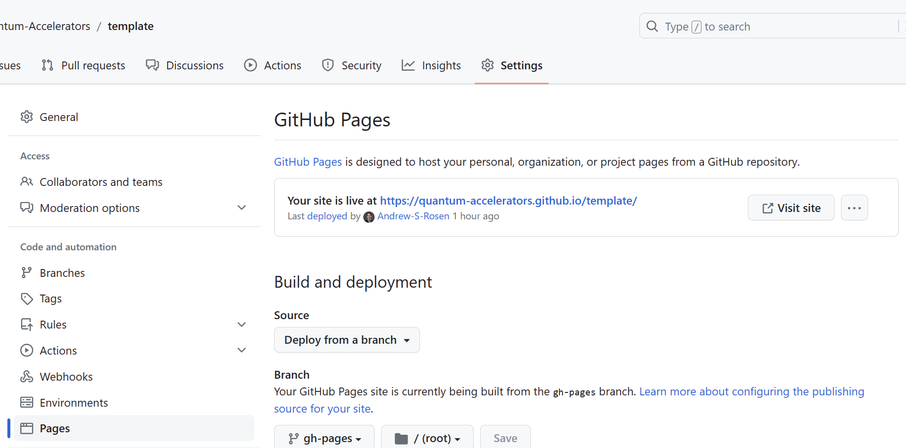

# GitHub Actions

## Workflows

The last major piece of the puzzle is GitHub Actions, which is an automated suite of workflows that run every time a commit or pull request is made. The GitHub workflows can be found in the `.github/workflows` folder.

## Tests

The `/.github/workflows/tests.yaml` file contains the workflow to have GitHub automatically run the full suite of tests on every commit and pull request. For the most basic case outlined here, you do not need to make any modifications (other than, perhaps, the desired Python versions you wish to test on).

By default, the test suite is set up to install the following packages:

```bash
pip install -r tests/requirements.txt
pip install .[dev]
```

As you can see above, it will install specific versions of the dependencies outlined in `/tests/requirements.txt`. Unlike `pyproject.toml`, you want to include specific versions here so that your test suite is reproducible.

The `/.github/dependabot.yml` file is set up such that [Dependabot](https://docs.github.com/en/code-security/getting-started/dependabot-quickstart-guide) will automatically open pull requests to update any versions in your `/tests/requirements.txt` file as they come out so that your code will always be tested on the newest releases of the various dependencies. This will ensure that your code doesn't break as dependencies update, but if it does, you will know what needs fixing.

## Documentation

The `/.github/workflows/docs.yaml` file contains the workflow to have GitHub test the build process for the documentation and deploy it (if enabled).

To have your documentation automatically deployed on a GitHub webpage:

1. Go to the settings page of your repository.
2. Click the "Pages" section under "Code and automation."
3. Select "Deploy from a branch" under "Source"
4. Set the branch to be "gh-pages" with "/ (root)" as the folder.
5. Wait a minute and refresh the page. You'll see a message that your site is live with a URL to the documentation.



Once this process is done, the documentation will be live and will update with each commit.

## Release

The `/.github/workflows/release.yaml` file contains the workflow to have GitHub upload your package to PyPI every time you mint a new release on GitHub. This is a slightly more advanced topic that you can read more about at a later time, but it's there for when you need it.
