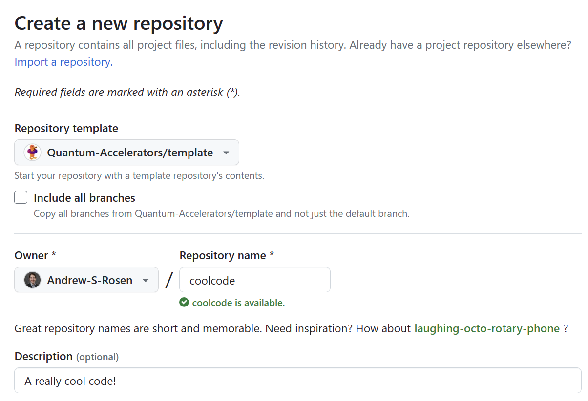
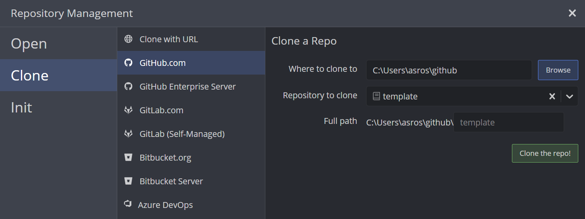

# Preparatory Steps

## Naming Your Package

So, you have an idea for your own Python package. The first thing you'll need to do is come up with a name!

!!! Tip

    If you plan on making a Python package that is widely distributed, first check to see if the name already exists on [PyPI](https://pypi.org/).

## Making a Repository

With a nice name in mind, [create a new repository](https://github.com/new?template_name=template&template_owner=Quantum-Accelerators) using this template. Give it a name, a description, and decide if you want it to be public or private.



## Cloning Your Repository

You'll now want to [clone the repository](https://github.com/git-guides/git-clone) to your local machine so you can easily make changes.

### Via a Desktop Client

You can use a desktop client to interface with GitHub. It is worthwhile to learn how to use such a program for your day-to-day work.

!!! Tip

    We strongly suggest using [GitKraken](https://www.gitkraken.com/) to interface with git and GitHub. GitKraken Pro is also [free for students](https://help.gitkraken.com/gitkraken-client/gitkraken-edu-pack/).



### Via the Command Line

If you prefer, you can clone the repository via the following command in the command-line, provided you have [git](https://git-scm.com/) installed.

```bash
git clone https://github.com/MyAccountName/MyPackageName
```

You can get the URL directly from the GitHub page when you click the green "<> Code" button.
